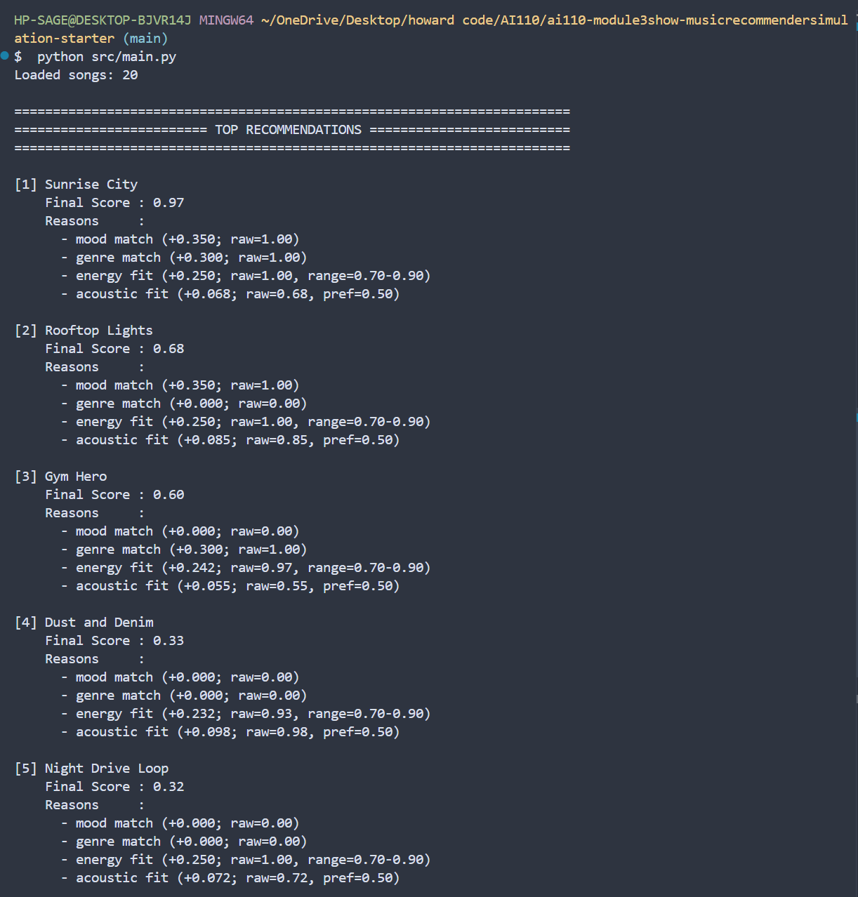
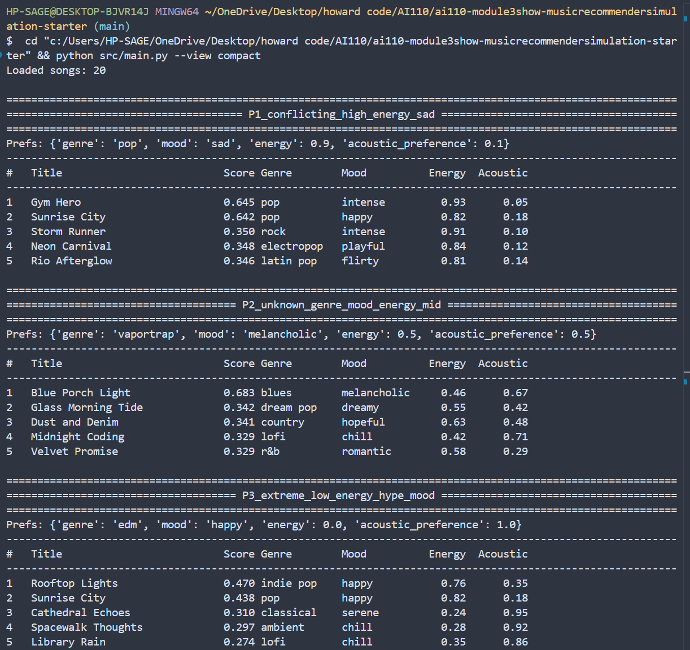
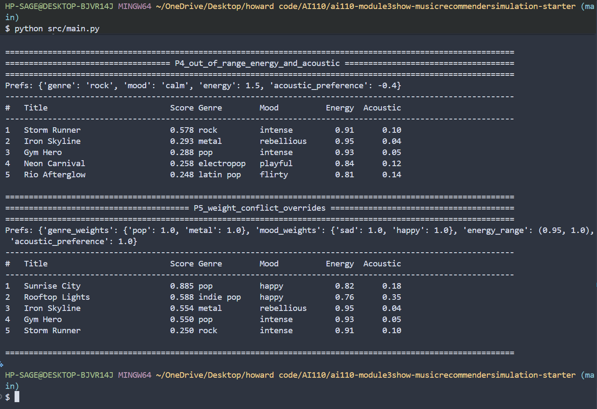

# 🎵 Music Recommender Simulation

## Project Summary

In this project you will build and explain a small music recommender system.

Your goal is to:

- Represent songs and a user "taste profile" as data
- Design a scoring rule that turns that data into recommendations
- Evaluate what your system gets right and wrong
- Reflect on how this mirrors real world AI recommenders

Replace this paragraph with your own summary of what your version does.

---

## How The System Works

Real-world recommendation systems usually combine many signals (your past listening, skips, likes, similar users, and song metadata) to estimate what you are most likely to enjoy next. This recommender uses a transparent scoring loop: every song in the CSV is scored against one user profile, then songs are sorted from highest to lowest score, and the top k are returned.

Finalized `UserProfile` for this simulation:

```
class UserProfile:
    # Multiple tastes with strength (0.0 to 1.0)
    genre_weights: Dict[str, float]
    mood_weights: Dict[str, float]

    # Prefer a range, not a single target
    energy_range: Tuple[float, float]

    # Continuous preference instead of yes/no
    # 0.0 = dislikes acoustic, 1.0 = strongly likes acoustic
    acoustic_preference: float

    # Optional extra signals for diversity + control
    diversity_boost: float # promotes varied top-k results
```

`Song` features used in this simulation:

- `id`
- `title`
- `artist`
- `genre`
- `mood`
- `energy`
- `tempo_bpm`
- `valence`
- `danceability`
- `acousticness`

Algorithm Recipe:

1. Load all songs from `data/songs.csv`.
2. Store preferences like

```
genre_weights = {"indie pop": 1.0, "lofi": 0.8, "jazz": 0.5}
mood_weights = {"chill": 0.8, "happy": 0.55};
energy_range = (0.3, 0.7)
acoustic_preference = 0.2
```

2. For each song, compute:
   - `genre_match = genre_weights.get(song.genre.lower(), 0.0)`
   - `mood_match = mood_weights.get(song.mood.lower(), 0.0)`

$$
   energy\_match =
   \begin{cases}
   1, & e_{min} \le song.energy \le e_{max} \\
   \max(0,\ 1 - d), & \text{otherwise}
   \end{cases}
$$

$$
acoustic\_match = \max(0,\ 1 - |song.acousticness - p|)
$$

3. Combine components with balanced weights:
   - Mood: 0.35
   - Genre: 0.30
   - Energy: 0.25
   - Acousticness: 0.10

4. Compute final score:
   - `score = 0.35*mood_match + 0.30*genre_match + 0.25*energy_match + 0.10*acoustic_match`

5. Sort all songs by score descending.
6. Return top k recommendations and an explanation for each score.

Potential bias and limitation note:

- This system may still over-prioritize exact genre labels and miss songs with a strong mood/energy fit from other genres.
- With a small catalog, one or two genres can dominate the top results and reduce diversity.
- Binary mood and genre matching can oversimplify taste and ignore nuance (for example, songs that are both chill and focused).

---

## Getting Started

### Setup

1. Create a virtual environment (optional but recommended):

   ```bash
   python -m venv .venv
   source .venv/bin/activate      # Mac or Linux
   .venv\Scripts\activate         # Windows

   ```

2. Install dependencies

```bash
pip install -r requirements.txt
```

3. Run the app:

```bash
python -m src.main
```

## Demo Screenshots

### Initial Run

Terminal output showing the baseline recommender with default weights on five test profiles:



### User Test 1

Testing and comparison showing how recommendations changed across different profiles:





### Running Tests

Run the starter tests with:

```bash
pytest
```

You can add more tests in `tests/test_recommender.py`.

---

## Experiments You Tried

### Weight Shift Experiment

Changed the importance of energy and genre to see how it affected ranking:

- **Original weights:** Mood 35%, Genre 30%, Energy 25%, Acoustic 10%
- **Experimental weights:** Mood 35%, Genre 15%, Energy 50%, Acoustic 10%
- **Result:** Mood remained the dominant factor. Energy-focused profiles (P3, P4) saw slight reranking favoring high-energy/acoustic songs, but most top picks stayed the same. This showed that weight tweaks matter less than we expected when data is sparse.

### Five Adversarial User Profiles

Tested edge cases to probe system robustness:

- **P1 (Conflicting):** Wanted sad mood + super high energy (0.9). System ignored mood (no sad songs) and picked energetic pop.
- **P2 (Unknown taste):** Asked for "vaportrap" (fake genre) + melancholic. System nailed mood by falling back when genre match failed.
- **P3 (Opposite poles):** Wanted happy + extremely low energy + high acoustic. System couldn't satisfy all three and picked the mood winner.
- **P4 (Out of range):** Requested impossible values (energy 1.5, acoustic -0.4). System clamped gracefully and found reasonable matches.
- **P5 (Weighted conflicts):** Asked for pop + metal equally, sad + happy equally, 0.95–1.0 energy, max acoustic. System favored pop because it fit energy range better.

### Key Finding

Literal genre/mood matching creates filter bubbles. When rare moods (like "melancholic") appear only once in the dataset, users have zero alternatives even when emotionally adjacent songs exist.

See [Model Card](model_card.md) for full evaluation and reflection.

---

## Limitations and Risks

### Data Size and Representation

MoodMatch only scores from 20 songs. With such a small catalog and uneven mood distribution (11 moods appear only once), users asking for rare emotional tones get locked into a single recommendation with no alternatives. A real recommender needs diversity to feel useful.

### Literal Matching Creates Filter Bubbles

The system uses exact string matching for genres and moods. If you ask for a genre that doesn't exist (like "vaportrap"), that entire dimension scores zero for every song. Even worse, emotionally adjacent moods (e.g., "melancholic" vs. "dreamy") are treated as completely unrelated. Users with niche tastes get trapped.

### No Semantic Understanding

The system sees "sad" and "melancholic" as different categories, not similar moods. It doesn't understand that an acoustic folk song might satisfy someone asking for "unplugged" rock, or that a slow dance song might work for someone who said "energetic." This is why fuzzy matching and embeddings matter in production systems.

### Energy Gap Penalty Oversimplifies

The distance-based energy penalty treats energy as a single dimension. But the subjective experience of "energetic but moody" is different from "energetic and upbeat." Without nuance, compromises feel arbitrary.

For analysis of these limitations and future improvements, see the [Model Card](model_card.md).

---

## Reflection

### Key Learnings

Building MoodMatch taught me that recommender systems are deceptively simple on the surface but hide messy trade-offs underneath. The biggest lesson: **data shapes everything**. We have 20 songs, 16 moods (11 appearing only once), and 17 genres. Those numbers create bottlenecks. When a user asks for "melancholic" music, there's only one option. Our algorithm didn't fail—it just picked the only song available. A real Spotify has millions of songs, so fuzzy search and semantic similarity work. We can't use those tricks.

Rebalancing weights (doubling energy, halving genre) mattered less than expected. After the shift, mood still dominated rankings because exact genre matches were so rare in the first place. This taught me that **algorithmic tweaks are less powerful than data representation**. You can't engineer your way out of a bad dataset.

Most surprising: the system's biggest failure is graceful. Profile P2 asked for "vaportrap" (fake genre), and the system silently ignored that preference, falling back to mood and energy. It felt like the system "got lucky." But that's the trap—broken input produces silently mediocre output. Real systems need better fallbacks and explicit feedback to the user.

### Implications for Real Recommenders

When Spotify recommends a song, it's balancing dozens of signals: your listen history, skip patterns, library additions, similar users' behavior, song metadata, and trending data. If you ask for three contradictory things, the algorithm picks winners without telling you. Our small system reveals that design choice. On real apps, the math is much more complex, but the fundamental trade-off remains: what do you optimize for when you can't satisfy everything?

Read the [**Model Card**](model_card.md) for detailed evaluation of what succeeded, where biases hide, and what we'd improve.

---

## 7. `model_card_template.md`

Combines reflection and model card framing from the Module 3 guidance. :contentReference[oaicite:2]{index=2}

```markdown
# 🎧 Model Card - Music Recommender Simulation

## 1. Model Name

Give your recommender a name, for example:

> VibeFinder 1.0

---

## 2. Intended Use

- What is this system trying to do
- Who is it for

Example:

> This model suggests 3 to 5 songs from a small catalog based on a user's preferred genre, mood, and energy level. It is for classroom exploration only, not for real users.

---

## 3. How It Works (Short Explanation)

Describe your scoring logic in plain language.

- What features of each song does it consider
- What information about the user does it use
- How does it turn those into a number

Try to avoid code in this section, treat it like an explanation to a non programmer.

---

## 4. Data

Describe your dataset.

- How many songs are in `data/songs.csv`
- Did you add or remove any songs
- What kinds of genres or moods are represented
- Whose taste does this data mostly reflect

---

## 5. Strengths

Where does your recommender work well

You can think about:

- Situations where the top results "felt right"
- Particular user profiles it served well
- Simplicity or transparency benefits

---

## 6. Limitations and Bias

Where does your recommender struggle

Some prompts:

- Does it ignore some genres or moods
- Does it treat all users as if they have the same taste shape
- Is it biased toward high energy or one genre by default
- How could this be unfair if used in a real product

---

## 7. Evaluation

How did you check your system

Examples:

- You tried multiple user profiles and wrote down whether the results matched your expectations
- You compared your simulation to what a real app like Spotify or YouTube tends to recommend
- You wrote tests for your scoring logic

You do not need a numeric metric, but if you used one, explain what it measures.

---

## 8. Future Work

If you had more time, how would you improve this recommender

Examples:

- Add support for multiple users and "group vibe" recommendations
- Balance diversity of songs instead of always picking the closest match
- Use more features, like tempo ranges or lyric themes

---

## 9. Personal Reflection

A few sentences about what you learned:

- What surprised you about how your system behaved
- How did building this change how you think about real music recommenders
- Where do you think human judgment still matters, even if the model seems "smart"
```
